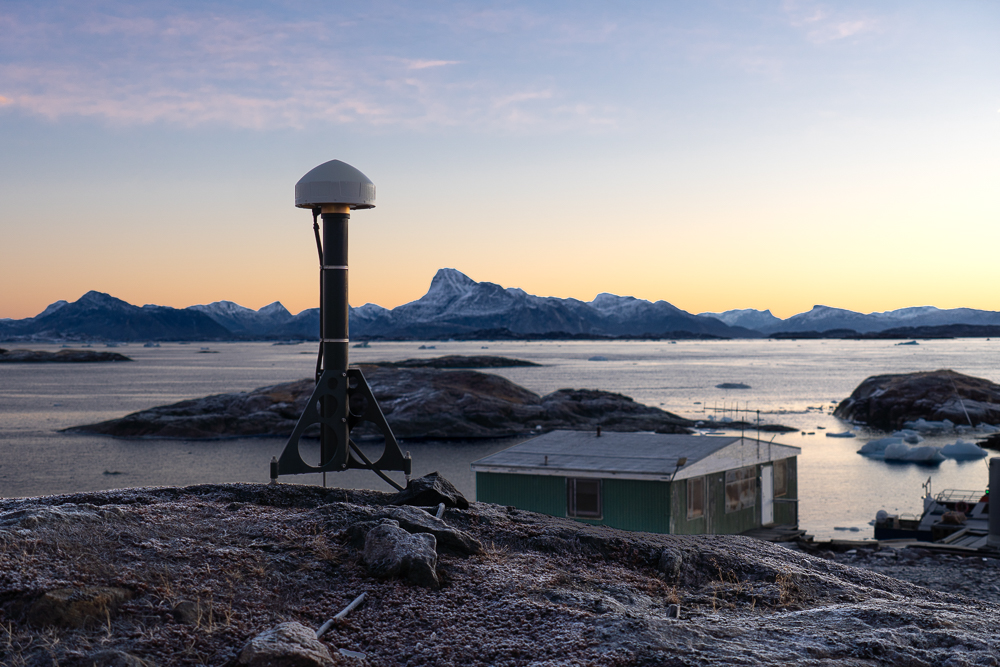

# Geodesy

My work revolves around geodesy. On these pages I keep various notes that
have proven useful to me over the years. They are primarily here as an
easily accessible reference for myself but they may also be useful for
others.

/// caption
GNET station KSUT with Nuuk in the background.
///